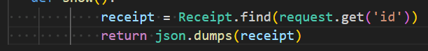

# VSCode - disable indent dots

## Problem 

Indent dots and lines are not necessary for presentation

## Solution

File -> Preferences -> Settings -> Render Whitespace: none
File -> Preferences -> Settings -> Editor> Guides: Indentation : uncheck 